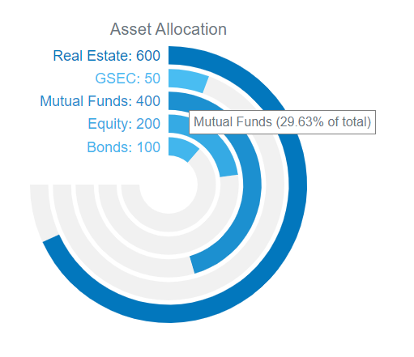

# vue-radial-bargraph
VueJS component for a simple radial bar graph made using d3

## Props

- `width` : `Number` - width of the graph in pixels(height will also be set to the same value). eg. `300`

- `values` : `Array`- Number Array containing values of the graph. Eg `[100,200,300]`

- `labels` : `Array`- String Array containing labels of graph. Eg `['Mango','Apple','Banana']`

- `colorScale` : `Array` - String Array containing the color scale. Graph entries will have colours scaled by this scale. Eg. `["#4FC3F7","#0277BD"]`

- `title` : `String` - Graph title 

- `labelText` : `String` - the format in which the label will be displayed. You can use `label`, `value` and `percent` variables as templates, the respective labels, values and percentages will be substituted in place. Eg if set as `label: value (percent of total)`, labels will be in this formatted as `Mango: 100 (16.66% of total)`

- `hoverText` : `String` - the format in which the tooltip text will be displayed. You can use `label`, `value` and `percent` variables as templates, the respective labels, values and percentages will be substituted in place. Eg if set as `label: value (percent of total)`, tooltips will be in this formatted as `Mango: 100 (16.66% of total)`